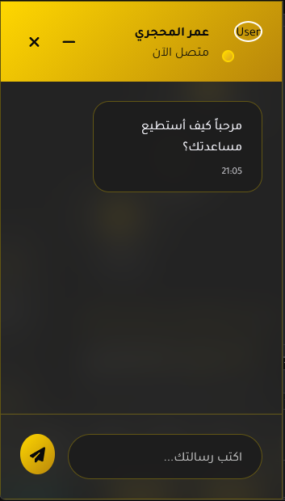
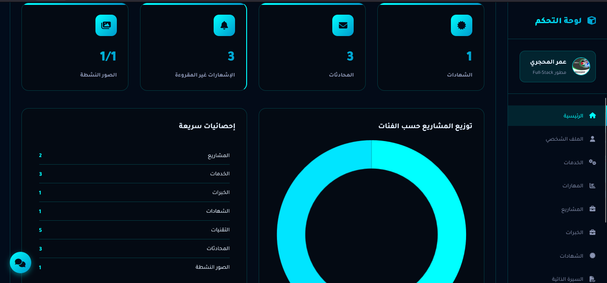
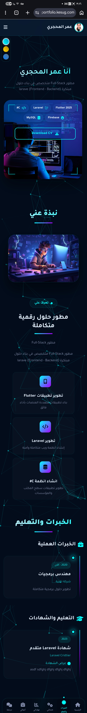
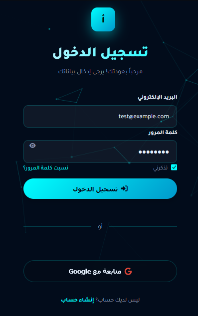

# MyPortfolio

## Project Description

"MyPortfolio" is a personal portfolio website built with Laravel 12 and PHP 8.2. It showcases resume content, experience, projects, services, skills, certifications, contact links, and includes a chat system with an admin panel.

The project supports:
- Standard authentication and session handling.
- Google OAuth login.
- Contact form email submission.
- Public and private chat functionality with message views.
- Admin dashboard for dynamic content management.
- Full CRUD for projects, services, experiences, certifications, CVs, tech stack, and portfolio images.
- Active CV download feature.
- Site settings and user profile management.

## Key Features

- Personal portfolio landing page.
- User login and registration pages.
- Google login integration.
- Contact form handled by `MailController`.
- Chat system with public and authenticated routes.
- Skill categories and skill item management.
- Project and service management.
- Experience, certification, and CV management.
- Tech stack and portfolio image management.

## Technical Stack

- Laravel 12
- PHP 8.2
- Laravel Socialite
- Laravel Tinker
- Eloquent ORM and database migrations
- Admin dashboard powered by `DashboardController`
- User role handling via `is_admin`

## Project Structure

- `app/Http/Controllers/` - Main controllers for site, auth, mail, and chat.
- `routes/web.php` - Web route definitions.
- `database/migrations/` - Database table structure for projects, services, experiences, certifications, links, notifications, CVs, settings, and more.
- `resources/views/` - Blade view templates.
- `assets/images/` - Project images.

## Local Setup

1. Clone the repository to your machine.
2. Install dependencies:
   ```bash
   composer install
   npm install
   ```
3. Copy `.env.example` to `.env`.
4. Generate the application key:
   ```bash
   php artisan key:generate
   ```
5. Run migrations:
   ```bash
   php artisan migrate
   ```
6. Start the local development server:
   ```bash
   php artisan serve
   ```

## Project Images

These images are in `assets/images/` and will display on GitHub when the repository is uploaded:

- `assets/images/chat.png`
- `assets/images/dashboard.png`
- `assets/images/Home.jpg`
- `assets/images/login.png`

### Image Preview









## Notes

When uploading to GitHub, make sure the following files exist in the repository:
- `assets/images/chat.png`
- `assets/images/dashboard.png`
- `assets/images/Home.jpg`
- `assets/images/login.png`

This will allow GitHub to render the images directly inside `README.md`.

## License

This project is licensed under the MIT License.
